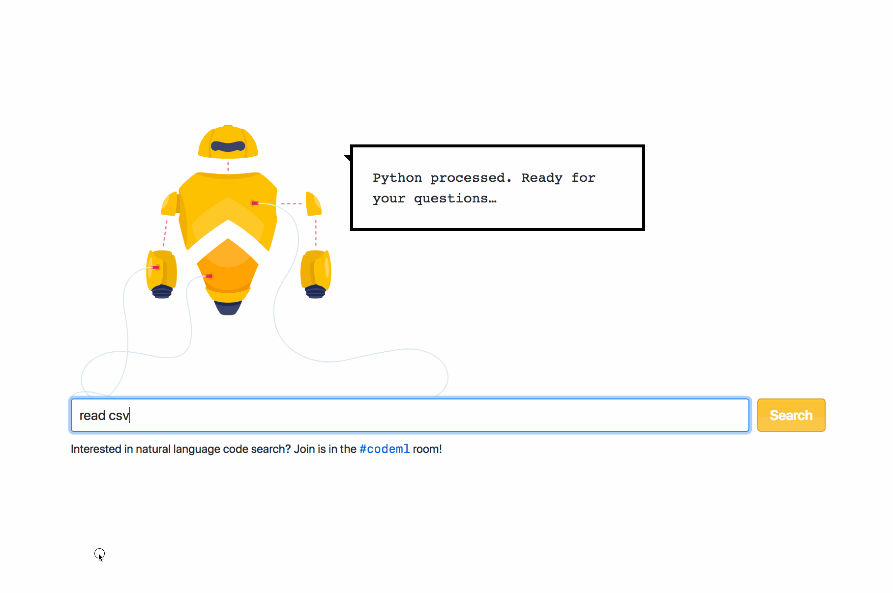

# Natural Language Semantic Code Search

## Live Demo: http://analytics-exploration-e26ed19.private-us-east-1.github.net:3000/

**Features:**

 - Searches code not comments. So you can find code that you are looking for!  We can add ability to search comments trivially.  
 - Can find code even if you don't know the syntax
 - Can find code even if you don't know what keywords to search for
 - Search is not sensitive to synonyms or specific word choice. Instead searches for "meaning"

**Product**
 - Product idea will be to augment our existing search (not replace it) by also returning results of semantic code search in addition to classic search.   

**Resources:**
- [Hackweek Talk (15 minutes](https://githubber.tv/hamelsmu/code-search-hackweek)
- 15 minute video: [How does this work?](https://youtu.be/nSQIyqtWroU)
- Technique that inspired this approach: [DeVisE](http://papers.nips.cc/paper/5204-devise-a-deep-visual-semantic-embedding-model.pdf)
- The open source version of this will be hosted [here](https://github.com/hamelsmu/code_search)
- Medium blog post: TBD

## Team

From left to right: [Hamel Husain](https://www.linkedin.com/in/hamelhusain/), [Ho-Hsiang Wu](https://www.linkedin.com/in/hohsiangwu/),  [Justin Palmer](https://github.com/caged)

&nbsp; | &nbsp; | &nbsp;
:---: | :---: | :---: 
 |  | 
